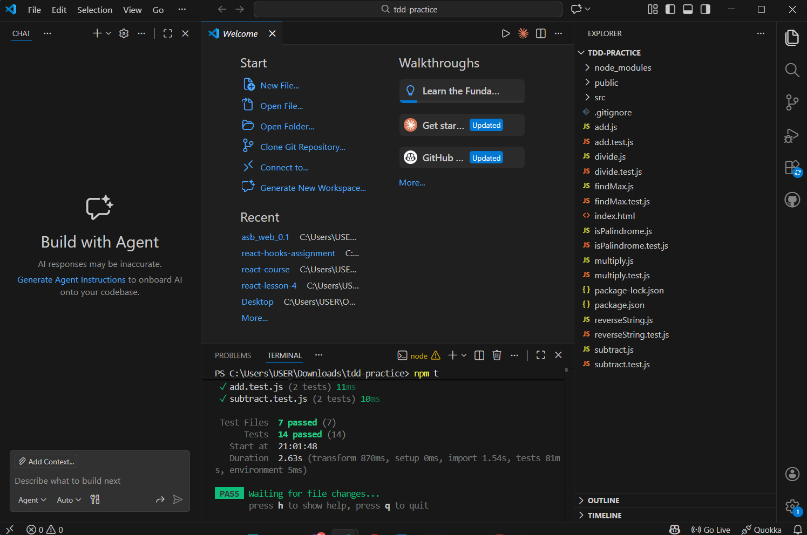

# Unit Testing Assignment

## 🎯 Task Overview

You are to implement and test the following utility functions:

Functions to Build

add(a, b) → Returns the sum

subtract(a, b) → Returns the difference

multiply(a, b) → Returns the product

divide(a, b) → Returns the quotient

Returns null if b === 0

reverseString(str) → Returns the reversed string

isPalindrome(str) → Returns true or false

findMax(arr) → Returns the largest number in the array

## 📋 Requirements

For EACH function:

Create a function.js file

Create a function.test.js file

Follow the TDD cycle:

Red – Write failing tests first

Green – Write the minimum code to pass

Write at least 2 test cases per function

## 📦 Project Goal

By the end of this project, you should be comfortable with:

Writing unit tests with Vitest

Practicing Test-Driven Development

Structuring small, testable JavaScript functions

